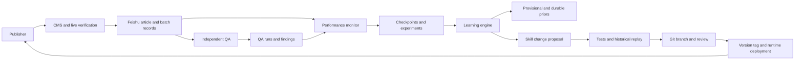

# Feishu Governance and Self-Evolving Skills

A reference architecture for connecting content publication, quality assurance,
performance monitoring and governed Skill evolution through Feishu Base.

> This document describes a reusable operating pattern. Deployment-specific
> Base IDs, credentials, article incidents and production snapshots belong in a
> private runbook, not in the architecture contract.

## Table of contents

- [Overview](#overview)
- [Design goals](#design-goals)
- [Architecture](#architecture)
- [Components](#components)
- [Configuration](#configuration)
- [Feishu data model](#feishu-data-model)
- [Execution and lineage](#execution-and-lineage)
- [Performance evidence lifecycle](#performance-evidence-lifecycle)
- [Skill evolution](#skill-evolution)
- [Release workflow](#release-workflow)
- [Safety model](#safety-model)
- [Failure handling](#failure-handling)
- [Observability](#observability)
- [Reference schedule](#reference-schedule)
- [Extension points](#extension-points)
- [Current limitations](#current-limitations)
- [Contributing](#contributing)

## Overview

Most content automation systems stop after publication. This architecture adds
a governed feedback loop:

```text
publish
  -> verify
  -> measure
  -> diagnose
  -> test a change
  -> learn
  -> release a new Skill version
```

Feishu Base acts as the governance and audit plane. It does not replace the CMS,
analytics providers, source repository or runtime Skill installation.

The system is divided into three layers:

```text
Feishu Base
  Operational state, evidence, approvals and immutable history

Git repository
  Versioned Skill source, tests, changelog, tags and rollback points

Runtime installation
  The exact Skill version used by scheduled production automations
```

## Design goals

- Preserve an auditable chain from topic selection to measured outcome.
- Keep writing, QA, publication, monitoring and learning as separate
  responsibilities.
- Make retries idempotent and every terminal state visible.
- Treat missing or immature data explicitly instead of converting it to zero.
- Allow performance evidence to influence future selection without allowing it
  to bypass demand, quality or safety gates.
- Version only material, tested and replay-safe Skill changes.
- Keep structural authority changes approval-gated.
- Support rollback to a known Git tag and runtime version.

### Non-goals

- Automatically rewriting content from a single early performance signal.
- Treating article count as the optimisation target.
- Allowing a content generator to approve its own output.
- Storing credentials, private source material or CMS secrets in Feishu.
- Making Feishu the source repository for Skill files.
- Turning an analytics outage into a successful or zero-value measurement.

## Architecture



The arrows represent evidence and control flow. They do not imply that one
component may silently mutate another component's data.

## Components

### Publisher

Responsibilities:

- create one deterministic run identity;
- select and publish only individually passing items;
- preserve CMS document ID and exact source revision;
- verify the rendered page after publication;
- register article assets, publication batch, QA identity and monitoring times.

The publisher must not report success before live verification and governance
handoff both pass.

### Independent QA

Responsibilities:

- review an exact document revision;
- return `PASS`, `FIX` or `BLOCK`;
- create immutable QA evidence and linked findings;
- prevent stale patches from applying to a newer revision.

QA defines the gate but does not directly publish.

### Performance monitor

Responsibilities:

- scan a rolling published cohort every day;
- verify live health and analytics source maturity;
- execute due milestone measurements;
- create diagnoses and controlled change proposals;
- write one monitor-run receipt even when no checkpoint is due.

Monitoring is read-only with respect to production content.

### Learning engine

Responsibilities:

- aggregate mature executed evidence;
- reject placeholders, blocked inputs and superseded retries;
- create expiring provisional priors;
- propose durable priors from mature evidence or verified experiments;
- replay proposals against historical candidate portfolios;
- preserve explicit no-promotion outcomes.

### Release adapter

Responsibilities:

- translate an accepted change into a Skill diff;
- update tests and changelog;
- create a Git branch and reviewable change;
- tag the released version;
- install the released version into the runtime;
- write commit, tag, deployment and rollback evidence back to Feishu.

## Configuration

Deployment identifiers must be supplied through configuration. Do not hardcode
credentials or private tenant IDs in reusable source.

Example:

```yaml
governance:
  provider: feishu_base
  base_token_env: FEISHU_BASE_TOKEN
  tables:
    automation_runs: ${FEISHU_AUTOMATION_RUNS_TABLE_ID}
    article_assets: ${FEISHU_ARTICLE_ASSETS_TABLE_ID}
    publication_batches: ${FEISHU_PUBLICATION_BATCHES_TABLE_ID}
    qa_runs: ${FEISHU_QA_RUNS_TABLE_ID}
    findings: ${FEISHU_FINDINGS_TABLE_ID}
    monitor_runs: ${FEISHU_MONITOR_RUNS_TABLE_ID}
    checkpoints: ${FEISHU_CHECKPOINTS_TABLE_ID}
    experiments: ${FEISHU_EXPERIMENTS_TABLE_ID}
    skill_changes: ${FEISHU_SKILL_CHANGES_TABLE_ID}

learning:
  rolling_cohort_days: 35
  comparison_window_days: 90
  promotion_check_hours: 48
  provisional_ttl_days: 8
  combined_adjustment_min: -3
  combined_adjustment_max: 3

release:
  repository: owner/repository
  default_branch: main
  runtime_skill_path: ${RUNTIME_SKILL_PATH}
  structural_changes_require_approval: true
```

Secrets must be resolved from environment variables, operating-system secret
stores or the deployment platform's secret manager.

## Feishu data model

The following logical tables form the governance plane. Physical table IDs are
deployment configuration.

| Logical table | Write model | Purpose |
| --- | --- | --- |
| Automation runs | Idempotent start plus one terminal update | Records every invocation, action, count, blocker, receipt and evidence path |
| Article assets | One mutable current-state row per article key | Tracks canonical identity, current CMS revision and next monitoring times |
| Publication batches | Immutable | Preserves the exact publication or repair cohort and transaction lineage |
| QA runs | Immutable per document revision and QA version | Stores the independent quality decision |
| Findings | Immutable evidence with lifecycle state | Stores repair requirements, locators and verification |
| Monitor runs | Immutable per execution | Records source maturity, scanned scope, due nodes and writeback |
| Checkpoints | Immutable per deterministic review ID | Stores one article and one milestone result |
| Content reviews | Append-only collaboration view | Presents diagnoses and follow-up in an operator-friendly format |
| Experiments | One lifecycle row per controlled change | Tracks approval, execution and later verification |
| Skill changes | Immutable change history | Stores evidence, old/new rule, replay, release and rollback |

### Mutable versus immutable records

Current-state fields may be reconciled in the article-assets table. Historical
publication batches, QA decisions, findings, checkpoints, learning snapshots
and previous Skill versions remain immutable.

## Execution and lineage

### Deterministic identities

Recommended identities:

```text
execution_id
  = automation_id + scheduled_or_trigger_time

article_lineage
  = publication_run_id
  + article_key
  + cms_document_id
  + exact_source_revision
  + qa_run_id
  + canonical_url

checkpoint_id
  = article_key + source_revision + checkpoint_name + scheduled_time
```

### Idempotent write contract

Before creating a Feishu record:

1. search the complete target table using the exact business key;
2. create and read back when there are zero matches;
3. verify or reconcile permitted links when there is one match;
4. stop with a duplicate blocker when there are multiple matches;
5. never blindly retry an ambiguous write.

Every mutation must be read back. A successful API response without
business-key reconciliation is not completion evidence.

## Performance evidence lifecycle

| Age | Evidence level | Permitted use |
| --- | --- | --- |
| Daily pulse | Health evidence | Detect live, source, query, CTR and coverage changes |
| 24 hours | Preliminary | Confirm delivery and early engagement |
| 72 hours | Observation | Classify an initial mature Search or recommendation signal |
| 7 days | Candidate prior | Propose one controlled optimisation or provisional learning rule |
| 28 days | Durable input | Support durable learning, cannibalisation analysis and verified experiments |

The metric provider's finalisation date must cover the requested observation
window. Wall-clock age alone does not make data mature.

Missing states remain explicit:

- `DATA_NOT_MATURE`
- `SOURCE_BLOCKED`
- `NO_DUE_CHECKPOINT`
- `NO_ACTIONABLE_CHANGE`
- `null` for unsupported metrics

## Skill evolution

Skill evolution has two independent layers.

### Performance-prior layer

Performance priors affect portfolio ordering only after a candidate passes
normal eligibility.

A provisional prior may be generated from:

- at least three mature 72-hour articles across two publication runs with
  directional agreement of at least `0.67`; maximum adjustment magnitude `1`;
  or
- at least two mature 7-day articles across two publication runs with
  directional agreement of at least `0.75`; maximum adjustment magnitude `2`.

Evidence must have been executed recently. The reference implementation uses a
14-day maximum evidence age and an eight-day provisional TTL.

A durable prior requires mature 28-day evidence or a verified experiment and
must pass configured multi-article, multi-run and replay gates.

Priors may not:

- raise an ineligible candidate above the eligibility threshold;
- waive a veto;
- create demand evidence;
- create a hot or rising classification;
- bypass QA, publication or safety gates;
- clone a successful page.

Combined provisional and durable adjustment is bounded to `-3..+3`.

### Versioned-rule layer

At least once every promotion interval, the learning engine should:

1. collect rolling daily pulses and executed checkpoints;
2. deduplicate retries and retain the latest executed evidence;
3. reject immature, blocked and unsupported inputs;
4. aggregate outcomes by cluster, intent, title pattern, trend class and
   section;
5. create a rule proposal with evidence and rollback condition;
6. replay the proposal against development and holdout portfolios;
7. run deterministic scorer tests and Skill validation;
8. release, reject, expire or roll back the proposal;
9. record the decision in the governance plane.

When no material change qualifies, preserve the current version and record:

```text
NO_PROMOTION
NO_DURABLE_LESSON
NO_SKILL_CHANGE
```

Do not create cosmetic version bumps.

## Release workflow

Recommended Git-based release flow:

```text
qualified evidence
  -> immutable change proposal
  -> tests and historical replay
  -> approval when required
  -> update Skill, tests and changelog
  -> create a run-scoped Git branch
  -> review and merge
  -> create a semantic version tag
  -> deploy the tagged Skill
  -> verify the runtime version
  -> write commit, tag and rollback evidence to Feishu
```

Recommended release evidence:

- repository and branch;
- commit SHA;
- release tag;
- previous version;
- deployed runtime path;
- deployment readback;
- rollback tag;
- release receipt state.

Structural changes remain approval-gated:

- scoring weights or eligibility thresholds;
- demand-provider requirements;
- vetoes;
- source authority;
- QA boundaries;
- publication authority;
- production mutation permissions.

Tested non-structural clarifications may be released automatically when all
configured deterministic gates pass.

## Safety model

- Store no secrets or private source material in Feishu records.
- Redact credentials from logs and receipts.
- Require exact CMS revision checks before mutation.
- Never let the QA component publish directly.
- Never let the monitor mutate production content.
- Never let a learning prior change raw eligibility.
- Preserve historical decisions and evidence.
- Require explicit authority for structural or production-impacting changes.
- Keep every blocked, no-op and failed state visible.

## Failure handling

| Failure | Required behaviour |
| --- | --- |
| Start-ledger write fails | Stop material work and record a local failure artifact |
| Source is unavailable | Record `SOURCE_BLOCKED`; do not invent values |
| Data is not finalised | Record `DATA_NOT_MATURE`; defer classification |
| CMS revision changed | Block stale patch or publication |
| Feishu write is ambiguous | Read current state before retrying |
| Duplicate business key exists | Stop the affected write and create a maintenance blocker |
| Replay or tests fail | Reject the Skill proposal |
| Deployment readback fails | Keep the previous runtime version active |
| Notification result is unknown | Preserve `DELIVERY_UNKNOWN`; do not blindly resend |

## Observability

Every automation should emit:

- deterministic execution ID;
- start and end timestamps;
- scanned, processed, successful and blocked counts;
- source maturity;
- evidence and artifact paths;
- external transaction IDs;
- downstream handoff state;
- notification state;
- exact blocker or no-op reason;
- active Skill version and learning fingerprints when relevant.

A healthy quiet run is still an auditable run.

## Reference schedule

The reference implementation uses:

| Stage | Cadence |
| --- | --- |
| Publication | Daily |
| Independent QA and repair intake | Daily, after publication |
| Performance pulse and due checkpoints | Daily |
| Learning aggregation and release observation | Twice daily; mature promotion thresholds unchanged |

Schedules are deployment configuration. They must preserve stage ordering and
must not broaden publication authority.

## Extension points

The architecture can support other systems by implementing adapters for:

- governance store: Feishu Base, Airtable or a relational database;
- CMS: Sanity, Contentful or another revisioned content system;
- analytics: GSC, GA4 or equivalent providers;
- notification: an internal robot, Slack or another auditable channel;
- scheduler: Codex automation, cron or a workflow orchestrator;
- release: GitHub, GitLab or another versioned repository.

An adapter must preserve the same identity, maturity, immutability, readback
and authority contracts.

## Current limitations

- The repository packages the architecture and deterministic tools but does not
  include a universal Feishu tenant installer.
- CMS publication remains deployment-specific because schemas and revision
  rules differ.
- Git release automation must be connected explicitly; generating a learning
  proposal does not automatically authorise a repository change.
- Analytics delays can postpone learning even when wall-clock checkpoints are
  due.
- Structural Skill changes still require a human approval surface.

## Contributing

Contributions should include:

1. a concise problem statement;
2. the affected contract or component;
3. backward-compatibility and migration notes;
4. tests or replay evidence;
5. security and authority impact;
6. rollback behaviour;
7. documentation updates.

Do not submit production credentials, private tenant IDs, customer data,
private article evidence or deployment-specific secrets.
